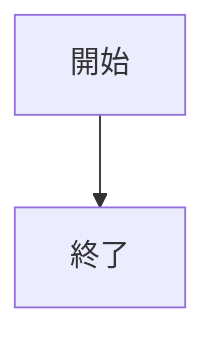
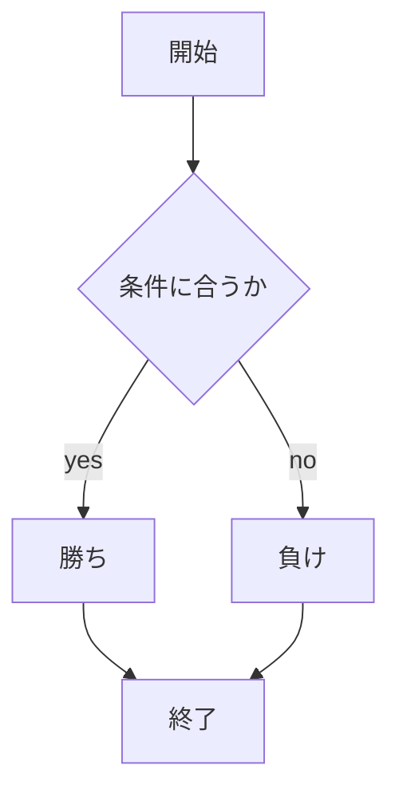

# webpro_06
2024/10/29(火)
## 　このプログラムについて

## ファイル一覧

ファイル名 | 説明
-|-
app5.js | プログラム本体
public/janken.html | じゃんけんの開始画面
views/janken.ejs | じゃんけんテンプレート

## プログラムの使用方法
1. ```node app5.js```でapp5.jsを起動する
1. Webブラウザから```locahost:8080/public/janken.html```にアクセスする
1. ```グー```,```チョキ```,```パー```のいずれかの手を入力

#### ソースコード挿入例
```javascript
console.log('Hello');
```
#### 図の描画



