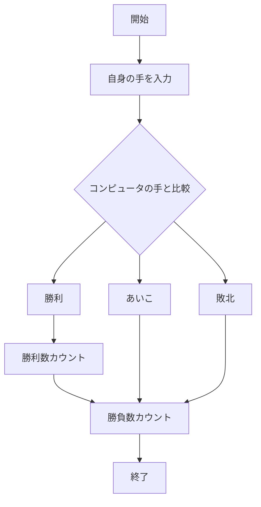
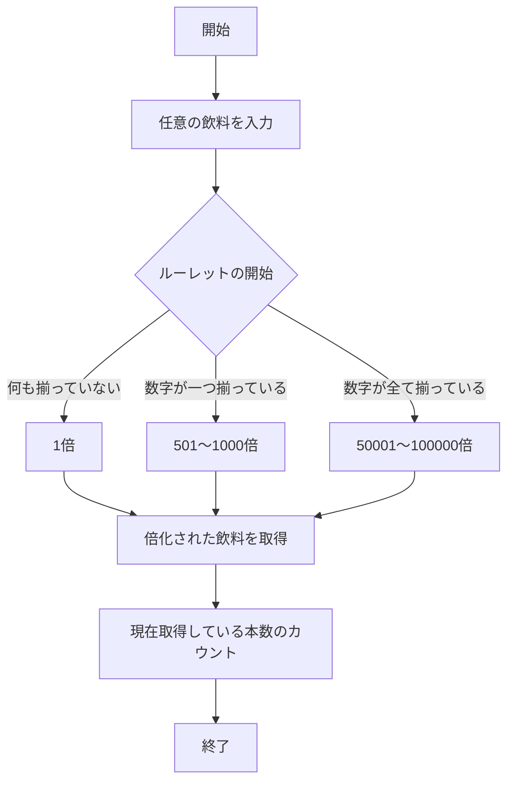
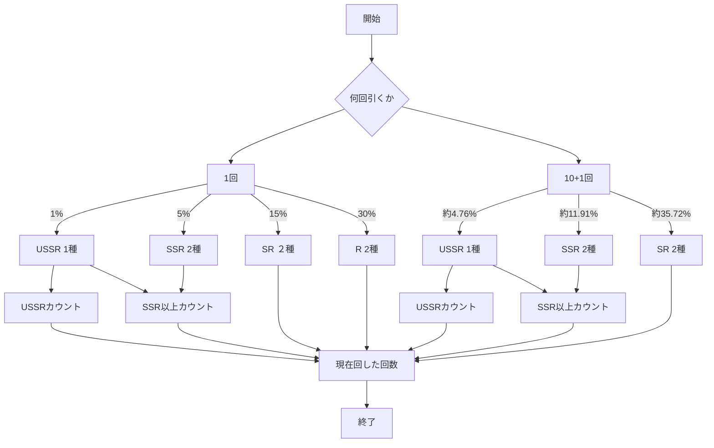

# webpro_06
## 　このプログラムについて
このプログラムは，webプログラミングの授業レポートで作成したwebサーバー上で動作する簡単な機能を持ったアプリケーションである．
## ファイル一覧
ファイル名 | 説明
-|-
app5.js | プログラム本体
public/index.html | 目次画面
public/Apple_logo_black.svg | Appleのロゴ
public/janken.html | じゃんけんの開始画面
public/jihanki.html | 自販機の開始画面
public/gatya.html | ガチャの開始画面
public/style.css | index.htmlで利用したcssファイル
views/show.ejs | 挨拶テンプレート
views/luck.ejs | おみくじテンプレート
views/icon.ejs | アイコンテンプレート
views/janken.ejs | じゃんけんテンプレート
views/jihanki.ejs | 自販機テンプレート
views/gatya.ejs | ガチャテンプレート


## プログラムの使用方法
#### 基本的な使用方法
1. ```node app5.js```でapp5.jsを起動する．
1. Webブラウザから```localhost:8080/public/index.html```にアクセスする．
1. 使用したい機能を選ぶ．
(2で，直接```localhost:8080/public/(使用したい機能.html)```にアクセスしてもよい)

## 各機能について
#### 挨拶
このプログラムでは，アクセスすることで英語の挨拶とフランス語の挨拶を表示できる．
使用する場合は```index.html```から「挨拶」を選択するか，```localhost:8080/show)```に直接アクセスする．

#### おみくじ
このプログラムでは，おみくじを引いて今日の運勢を占うことができる．出るのは「大吉」「中吉」「吉」の三種類である.
使用する場合は```index.html```から「おみくじ」を選択するか，```localhost:8080/luck)```に直接アクセスする．

#### アイコン
このプログラムでは，アクセスすることでアップルのロゴを表示することができる．
使用する場合は```index.html```から「アイコン」を選択するか，```localhost:8080/icon)```に直接アクセスする．

#### じゃんけん
このプログラムでは，CPUとじゃんけんをすることができる．入力欄に自身の手を入力するとCPUと比較し，勝敗を決める．
また，累計勝負数，累計勝利数を表示することもできる．
以上の仕様を以下のフローチャートに示す．


使用する場合は```index.html```から「じゃんけん」を選択するか，```localhost:8080/public/janken.html)```に直接アクセスする．

#### 自販機
このプログラムでは，任意の飲料の名前を入力することで，ルーレットが開始する．そのルーレットの値によって飲料が増加し，大量の飲料を取得することができる．ルーレットの条件と倍率は以下の通りである．
- ルーレットの数字が揃っていない場合　->　１倍
- ルーレットのいずれかの数字が揃っている場合　->　501〜1000倍
- ルーレットが全て揃っている場合　->　50001〜100000倍

また，現在取得している飲料の本数をカウントすることも可能である．
以上の仕様を以下のフローチャートに示す．


使用する場合は```index.html```から「自販機」を選択するか，```localhost:8080/public/jihanki.html)```に直接アクセスする．

#### ガチャ
このプログラムでは，1回か10+1回かを選択し送信することで，選択した回数ガチャを引き，任意の四字熟語などを取得することができる．
提供確率は以下の通りである．
- 1%でUSSR(1種)
- 5%でSSR(2種)
- 15%でSR(2種)
- 30%でR(2種)

また，10+1回引くと，追加の1回ではSR以上が必ず出現する．これは通常の提供確率からRを排除した確率で提供されるため，提供確率は以下のとおりである．
- 約4.76%でUSSR(1種)
- 約11.91%でSSR(2種)
- 約35.72%でSR(2種)

加えて，現在引いた数，SSR以上の獲得枚数，USSRの獲得枚数をカウントすることもできる．
以上の仕様を以下のフローチャートに示している．


使用する場合は```index.html```から「四字熟語ガチャ」を選択するか，```localhost:8080/public/gatya.html)```に直接アクセスする.


